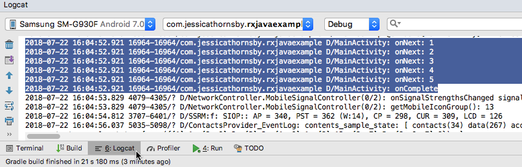
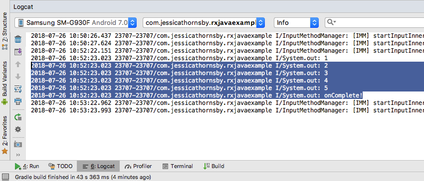
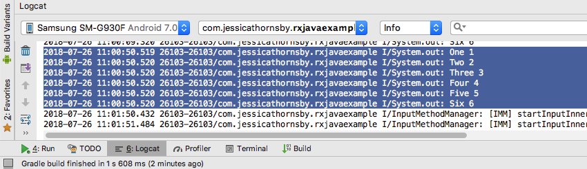

# 使用RxJava和RxKotlin进行Kotlin反应式编程

 [view the original English article](https://code.tutsplus.com/kotlin-reactive-programming-with-rxjava-and-rxkotlin--cms-31577t?ec_unit=translation-info-language)

自从成为Android开发的官方支持语言以来，Kotlin在Android开发人员中迅速普及，谷歌报告使用Kotlin创建的应用程序[增加了6倍](https://android-developers.googleblog.com/2018/05/google-io-2018-whats-new-in-android.html)。

如果您以前使用过RxJava或RxAndroid并且想要切换到Kotlin，或者想要使用Kotlin开始反应式编程，那么本教程适合您。 我们将介绍如何在Kotlin中创建RxJava 2.0 `Observers`，`Observables`和数据流的基本要素，然后再研究如何通过将RxJava与Kotlin扩展函数相结合来修剪项目中的大量样板代码。

将RxJava与Kotlin一起使用可以帮助您在更少的代码中创建高度反应性的应用程序，但是没有编程语言是完美的，所以我还将分享许多开发人员在他们第一次开始在Kotlin上使用RxJava 2.0时遇到的SAM转换问题的解决方法。

为了总结，我们将创建一个应用程序来演示如何使用RxJava来解决在现实生活中的Android项目中遇到的一些问题。

如果这是您第一次尝试RxJava，那么我将继续提供您理解核心RxJava概念所需的所有背景信息。 即使您以前从未尝试过RxJava，在本文结束时您将对如何在项目中使用此库有充分的了解，*并且*您将使用RxJava，RxKotlin，RxAndroid创建多个工作应用程序 和RxBinding。

### 无论如何，RxJava是什么？

RxJava是ReactiveX库的开源实现，可帮助您以反应式编程风格创建应用程序。 虽然RxJava旨在处理同步和异步数据流，但它并不局限于“传统”数据类型。 RxJava对“数据”的定义非常广泛，包括缓存，变量，属性甚至用户输入事件（如点击和滑动）。 仅仅因为您的应用程序不处理大量数据或执行复杂的数据转换，并不意味着它无法从RxJava中受益！

那么RxJava如何运作？

RxJava扩展了Observer软件设计模式，该模式基于Observers和Observables的概念。 要创建基本的RxJava数据管道，您需要：

- 创建一个Observable。
- 给Observable一些要发出的数据。
- 创建一个观察者。
- 将观察者订阅到Observable。

一旦Observable至少有一个Observer，它就会开始发送数据。 每次Observable发出一段数据时，它都会通过调用`onNext()`方法通知其指定的Observer，然后Observer通常会执行一些操作来响应此数据发送。 一旦Observable完成发送数据，它将通过调用`onComplete()`通知Observer。 然后Observable将终止，数据流将结束。

如果发生异常，则将调用`onError()`，并且Observable将立即终止，而不会发出任何更多数据或调用`onComplete()`。

但是RxJava**不只是**将数据从Observable传递给Observer！ RxJava[有大量的运算符](https://reactivex.io/documentation/operators.html)，可用于过滤，合并和转换此数据。 例如，假设您的应用有一个“**立即付款**”按钮，可以检测`onClick`事件，并且您担心不耐烦的用户可能会多次点按该按钮，从而导致您的应用处理多笔付款。

RxJava允许您将这些`onClick`事件转换为数据流，然后您可以使用RxJava的各种运算符进行操作。 在此特定示例中，您可以使用`debounce()`运算符来过滤快速连续发生的数据排放，因此即使用户在“**立即付款**”按钮上消失，您的应用也只会注册一次付款。

### 使用RxJava有什么好处？

我们已经看到RxJava如何在特定的应用程序中帮助您解决特定问题，但一般来说它有什么能提供Android项目？

RxJava可以通过为您提供编写您想要实现的内容的方法来帮助简化代码，而不是编写应用程序必须完成的指令列表。 例如，如果您想忽略在相同的500毫秒内发生的所有数据发射，那么您可以写：

```
.debounce(500, TimeUnit.MILLISECONDS) 
```


此外，由于RxJava**几乎将所有内容**都视为数据，因此它提供了一个模板，您可以将其应用于各种事件：创建一个Observable，创建一个Observer，将Observer订阅到Observable，冲洗并重复。 这种公式化方法产生了更直接，人类可读的代码。

Android开发人员的另一个主要好处是RxJava可以消除Android上多线程的痛苦。 今天的移动用户希望他们的应用程序能够执行多任务，即使它像在后台下载数据一样简单，同时保持对用户输入的响应。

Android有几个用于创建和管理多个线程的内置解决方案，但这些解决方案都不是特别容易实现，并且它们很快就会导致复杂，冗长的代码难以阅读并且容易出错。

在RxJava中，您可以使用运算符和调度程序的组合来创建和管理其他线程。 您可以使用`subscribeOn`运算符和调度程序轻松更改执行工作的线程。 例如，这里我们要安排在新线程上执行的工作：

```
.subscribeOn(Schedulers.newThread()) 
```


您可以使用`observeOn`运算符指定应该发布此工作结果的位置。 在这里，我们使用`AndroidSchedulers.mainThread`调度程序将结果发布到Android的所有重要主UI线程，该调度程序作为RxAndroid库的一部分提供：

```
.observeOn(AndroidSchedulers.mainThread()) 
```


与Android的内置多线程解决方案相比，RxJava的方法*更*简洁，更易于理解。

同样，您可以在我的[RxJava 2入门Android](https://code.tutsplus.com/getting-started-with-rxjava-20-for-android--cms-28345t)文章中了解有关RxJava如何工作的更多信息，以及将此库添加到项目中的好处。

### 我应该使用RxJava还是RxKotlin？

由于Kotlin与Java 100％可互操作，因此您可以毫无困难地在Kotlin项目中使用大多数Java库 - 而RxJava库也不例外。

*有*一个专用的[RxKotlin库](https://github.com/ReactiveX/RxKotlin)，它是常规RxJava库周围的Kotlin包装器。 该包装器提供了针对Kotlin环境优化RxJava的扩展，并且可以进一步减少需要编写的样板代码量。

由于您可以在Kotlin中使用RxJava而不需要RxKotlin，因此除非另有说明，否则我们将在本文中使用RxJava。

## 在Kotlin中创建简单的观察者和观察者

观察者和Observable是RxJava的构建块，所以让我们从创建：

- 一个简单的Observable，它响应按钮单击事件发出短数据流。
- 一个Observable，通过向Android Studio的**Logcat**打印不同的消息来对此数据做出反应。

使用您选择的设置创建一个新项目，但请确保在出现提示时选中**Include Kotlin support**复选框。 接下来，打开项目的**build.gradle**文件，并将RxJava库添加为项目依赖项：

```
dependencies {
  implementation fileTree(dir: 'libs', include: ['*.jar'])
  implementation "org.jetbrains.kotlin:kotlin-stdlib-jdk7:$kotlin_version"
  implementation 'androidx.appcompat:appcompat:1.0.0-alpha1'
  implementation 'androidx.constraintlayout:constraintlayout:1.1.0'
  // 添加这里
  implementation 'io.reactivex.rxjava2:rxjava:2.1.9'
}                                                        
```


然后，打开项目的**activity_main.xml**文件并添加将启动数据流的按钮：

```
<?xml version="1.0" encoding="utf-8"?>
<LinearLayout xmlns:android="http://schemas.android.com/apk/res/android"
  xmlns:tools="http://schemas.android.com/tools"
  android:layout_width="match_parent"
  android:layout_height="match_parent"
  android:orientation="vertical"
  tools:context=".MainActivity" >
  <Button
      android:id="@+id/button"
      android:layout_width="wrap_content"
      android:layout_height="wrap_content"
      android:text="Start RxJava stream" />
</LinearLayout>
```


创建Observable有几种不同的方法，但最简单的方法之一是使用`just()`运算符将对象或对象列表转换为Observable。

在下面的代码中，我们创建了一个Observable（`myObservable`）并为其提供了要发出的项目1,2,3,4和5。 我们还创建了一个Observer（`myObserver`），将它订阅到`myObservable`，然后告诉它每次收到新的发射时都会向**Logcat**打印一条消息。

```
import androidx.appcompat.app.AppCompatActivity
import android.os.Bundle
import android.util.Log
import io.reactivex.Observable
import io.reactivex.Observer
import io.reactivex.disposables.Disposable
import kotlinx.android.synthetic.main.activity_main.*
class MainActivity : AppCompatActivity() {
  private var TAG = "MainActivity"
  override fun onCreate(savedInstanceState: Bundle?) {
      super.onCreate(savedInstanceState)
      setContentView(R.layout.activity_main)
      
      // Start the stream when the button is clicked
      button.setOnClickListener { startRStream() }
  }
  
  private fun startRStream() {
      // Create an Observable
      val myObservable = getObservable()
      
      // Create an Observer
      val myObserver = getObserver()
      
      // Subscribe myObserver to myObservable
      myObservable
              .subscribe(myObserver)
  }
  
  private fun getObserver(): Observer<String> {
      return object : Observer<String> {
          override fun onSubscribe(d: Disposable) {
          }
          // Every time onNext is called, print the value to Android Studio’s Logcat
          override fun onNext(s: String) {
              Log.d(TAG, "onNext: $s")
          }
          // Called if an exception is thrown
          override fun onError(e: Throwable) {
              Log.e(TAG, "onError: " + e.message)
          }
          // When onComplete is called, print the following to Logcat// 
          override fun onComplete() {
              Log.d(TAG, "onComplete")
          }
      }
  }
  
  // Give myObservable some data to emit
  private fun getObservable(): Observable<String> {
      return Observable.just("1", "2", "3", "4", "5")
  }
}
```


您现在可以将此应用程序用于测试：

- 在物理Android智能手机或平板电脑或Android虚拟设备（AVD）上安装项目。
- 单击“**启动RxJava流**”按钮。
- 通过选择**Android Monitor**选项卡（光标位于以下屏幕截图中），然后选择**Logcat**选项卡，打开Android Studio的Logcat Monitor。

此时，Observable将开始发送其数据，Observer将其消息打印到Logcat。 您的Logcat输出应如下所示：



如果您想亲自尝试，可以[从GitHub下载此项目](https://github.com/tutsplus/reactive-kotlin-programming-basic-example)。


## RxJava的Kotlin扩展

现在我们已经了解了如何在Kotlin中设置一个简单的RxJava管道，让我们看看如何使用RxKotlin的扩展函数以*更少*的代码实现这一点。

要使用RxKotlin库，您需要将其添加为项目依赖项：

```
dependencies {
  implementation fileTree(dir: 'libs', include: ['*.jar'])
  implementation "org.jetbrains.kotlin:kotlin-stdlib-jdk7:$kotlin_version"
  implementation 'androidx.appcompat:appcompat:1.0.0-alpha1'
  implementation 'androidx.constraintlayout:constraintlayout:1.1.0'
  implementation 'io.reactivex.rxjava2:rxjava:2.1.9'
  //Add the following//
  implementation 'io.reactivex.rxjava2:rxkotlin:2.2.0'
}
```


在下面的示例中，我们使用RxKotlin的`toObservable()`扩展函数将`List`转换为Observable。 我们还使用了`subscribeBy()`扩展函数，因为它允许我们使用命名参数构造一个Observer，从而产生更清晰的代码。

```
import android.os.Bundle
import androidx.appcompat.app.AppCompatActivity
import io.reactivex.rxkotlin.subscribeBy
import io.reactivex.rxkotlin.toObservable
import kotlinx.android.synthetic.main.activity_main.*
class MainActivity : AppCompatActivity() {
  override fun onCreate(savedInstanceState: Bundle?) {
      super.onCreate(savedInstanceState)
      setContentView(R.layout.activity_main)
      
      // Start the stream when the button is clicked
      button.setOnClickListener { startRStream() }
  }
  
  private fun startRStream() {
      val list = listOf("1", "2", "3", "4", "5")
      // Apply the toObservable() extension function
      list.toObservable()
      // Construct your Observer using the subscribeBy() extension function
              .subscribeBy(
                      onNext = { println(it) },
                      onError = { it.printStackTrace() },
                      onComplete = { println("onComplete!") }
              )
  }
}
```


以下是您应该看到的输出：




### 解决RxJava的SAM模糊问题

当给定Java方法上存在多个SAM参数重载时，RxKotlin还为[SAM转换问题](https://youtrack.jetbrains.com/issue/KT-14984)提供了一个重要的解决方法。 这种SAM歧义混淆了Kotlin编译器，因为它无法确定它应该转换哪个接口，因此您的项目将无法编译。

当使用RxJava 2.0与Kotlin时，这种SAM模糊性是一个特殊问题，因为许多RxJava运算符采用多种SAM兼容类型。

让我们来看看运行中的SAM转换问题。 在下面的代码中，我们使用`zip()`运算符来组合两个Observable的输出：

```
import androidx.appcompat.app.AppCompatActivity
import android.os.Bundle
import io.reactivex.Observable
import kotlinx.android.synthetic.main.activity_main.*
class MainActivity : AppCompatActivity() {
  override fun onCreate(savedInstanceState: Bundle?) {
      super.onCreate(savedInstanceState)
      setContentView(R.layout.activity_main)
      
      // Start the stream when the button is clicked
      button.setOnClickListener { startRStream() }
      
  }
  private fun startRStream() {
      val numbers = Observable.range(1, 6)
      val strings = Observable.just("One", "Two", "Three",
              "Four", "Five", "Six" )
      val zipped = Observable.zip(strings, numbers) { s, n -> "$s $n" }
      zipped.subscribe(::println)
  }
}
```


这将导致Kotlin编译器抛出类型推断错误。 但是，RxKotlin为受影响的运算符提供了辅助方法和扩展函数，包括`Observables.zip()`，我们在以下代码中使用它：

```
import android.os.Bundle
import androidx.appcompat.app.AppCompatActivity
import io.reactivex.Observable
import io.reactivex.rxkotlin.Observables
import kotlinx.android.synthetic.main.activity_main.*
class MainActivity : AppCompatActivity() {
  override fun onCreate(savedInstanceState: Bundle?) {
      super.onCreate(savedInstanceState)
      setContentView(R.layout.activity_main)
      //Start the stream when the button is clicked
      button.setOnClickListener { startRStream() }
  }
  private fun startRStream() {
      val numbers = Observable.range(1, 6)
      val strings = Observable.just("One", "Two", "Three",
              "Four", "Five", "Six" )
      val zipped = Observables.zip(strings, numbers) { s, n -> "$s $n" }
      zipped.subscribe(::println)
  }
}
```


这是这段代码的输出：



## 结论

在本教程中，我向您展示了如何在Kotlin项目中开始使用RxJava库，包括使用许多其他支持库，例如RxKotlin和RxBinding。 我们研究了如何使用扩展函数在Kotlin中创建简单的Observers和Observable，直到为Kotlin平台优化RxJava。

到目前为止，我们已经使用RxJava创建了发出数据的简单Observable，以及将这些数据打印到Android Studio的Logcat的观察者 - 但这不是你在现实世界中使用RxJava的方式！